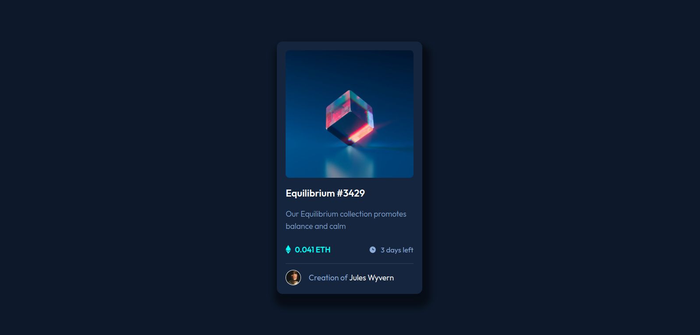
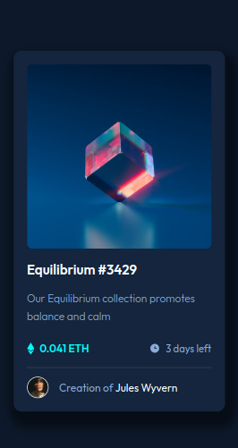

This is a solution for a challenge from [frontendmentor.io](https://www.frontendmentor.io/)

## Table of contents

- [Overview](#overview)
  - [Links](#links)
  - [Screenshot](#screenshot)
- [My process](#my-process)
  - [Built with](#built-with)
- [Acknowledgments](#acknowledgments)

## Overview

### Links

- Solution URL: [Solution]()
- Live Site URL: [Live Site]()

### Screenshot

This is the desktop view screenshot of the project

This the mobile view the screenshot of the project

## My process

### Built with

- Semantic HTML5 markup
- CSS custom properties
- Flexbox
- Mobile-first workflow
- [React](https://reactjs.org/) - JS library

## Acknowledgments

A big thank you to anyone providing feedback on my [solution]().
